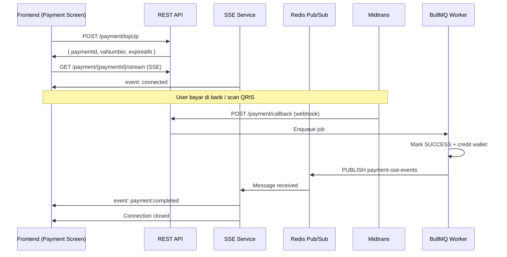
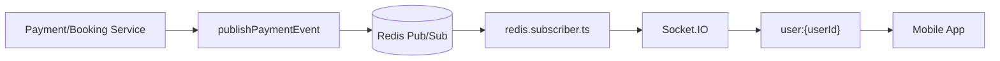
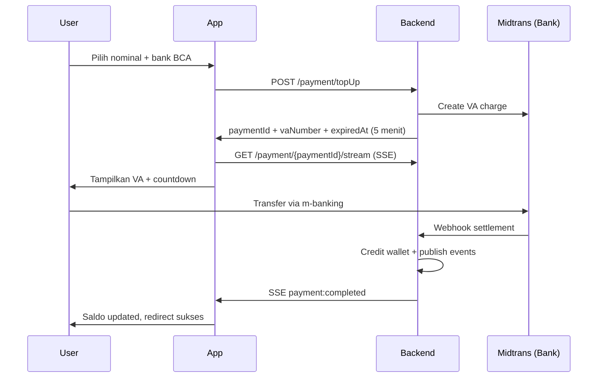
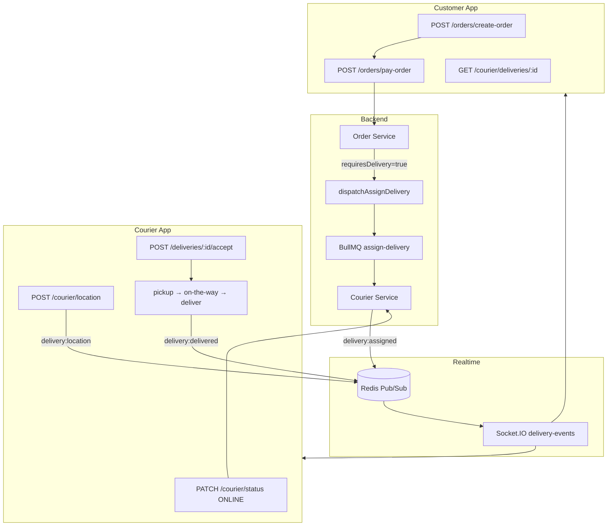
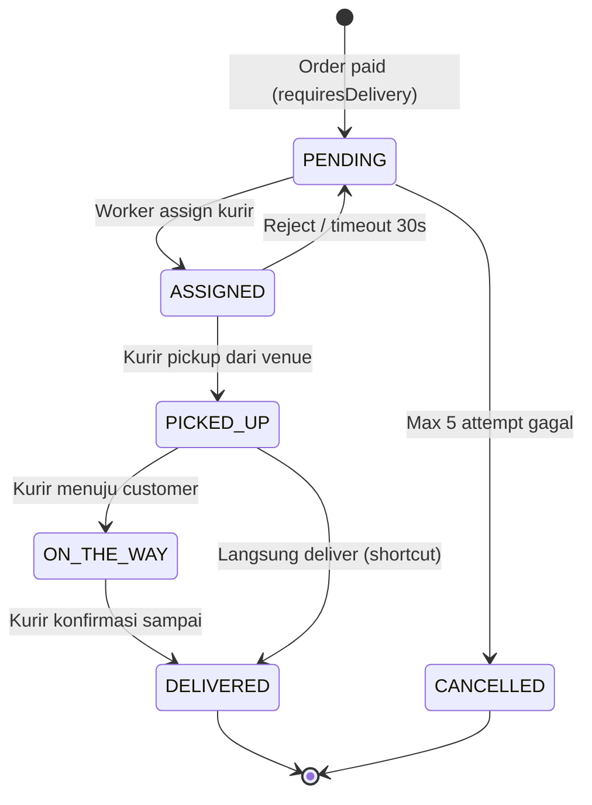
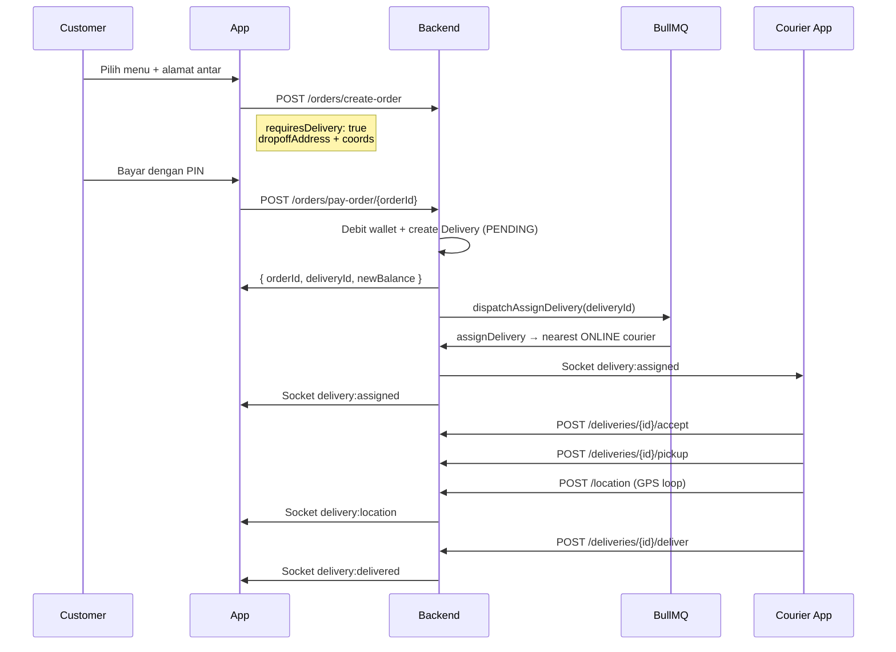
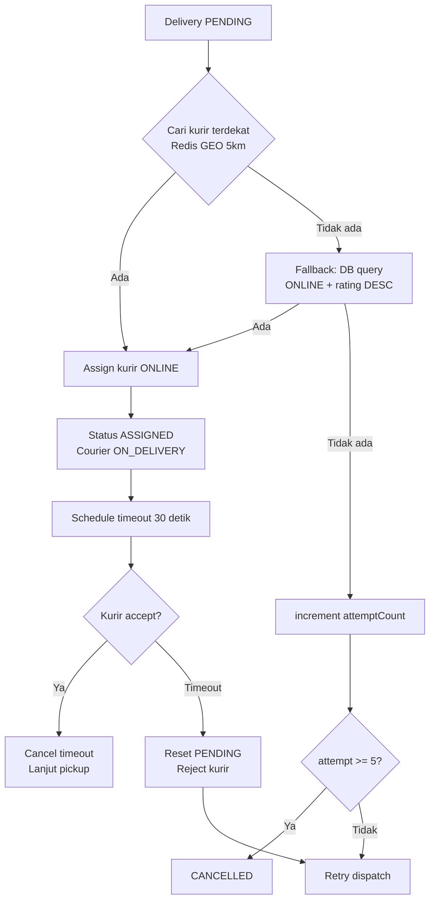

# Realtime Payment (SSE) & Courier Delivery — Dokumentasi Teknis

Dokumen ini menjelaskan arsitektur, alur, endpoint, dan integrasi frontend untuk:

1. **Payment Realtime** — top-up Midtrans (VA/QRIS) via SSE + Socket.IO
2. **Wallet Payment** — booking, order, tiket (sinkron via HTTP + Socket.IO)
3. **Courier Delivery** — assignment kurir, lifecycle delivery, GPS tracking

> Base URL API: `http://localhost:3100/api/v1`  
> Socket.IO: `http://localhost:3101` (port `SOCKET_PORT`)  
> Swagger: `http://localhost:3100/api-docs`

---

## Daftar Isi

- [Konsep Umum](#konsep-umum)
- [Bagian 1: Payment Realtime](#bagian-1-payment-realtime)
  - [Jenis Pembayaran](#jenis-pembayaran)
  - [Arsitektur SSE](#arsitektur-sse)
  - [Arsitektur Socket.IO Payment](#arsitektur-socketio-payment)
  - [Event Schema Payment](#event-schema-payment)
  - [Endpoint Payment](#endpoint-payment)
  - [Alur Top-up VA](#alur-top-up-va)
  - [Alur Top-up QRIS](#alur-top-up-qris)
  - [Alur Wallet Payment](#alur-wallet-payment)
  - [Integrasi FE — Payment](#integrasi-fe--payment)
- [Bagian 2: Courier & Delivery](#bagian-2-courier--delivery)
  - [Arsitektur Courier](#arsitektur-courier)
  - [Status Lifecycle](#status-lifecycle)
  - [Event Schema Delivery](#event-schema-delivery)
  - [Endpoint Courier](#endpoint-courier)
  - [Alur Order + Delivery](#alur-order--delivery)
  - [Alur Assignment Kurir](#alur-assignment-kurir)
  - [Alur Lifecycle Kurir](#alur-lifecycle-kurir)
  - [Integrasi FE — Courier](#integrasi-fe--courier)
  - [Integrasi FE — Customer Tracking](#integrasi-fe--customer-tracking)
- [Referensi File Backend](#referensi-file-backend)
- [Checklist Integrasi FE](#checklist-integrasi-fe)

---

## Konsep Umum

Backend menggunakan **strategi berbeda** per jenis transaksi:

| Jenis | Contoh | Mekanisme Primary | Mekanisme Secondary |
|-------|--------|-------------------|---------------------|
| **Gateway (async)** | Top-up VA/QRIS Midtrans | SSE di payment screen | Socket.IO + polling fallback |
| **Wallet (sync)** | Booking, order, tiket | HTTP response langsung | Socket.IO `balance:updated` |
| **Delivery (async)** | Order antar via kurir | Socket.IO tracking | GET polling status delivery |

**Socket.IO** dipakai untuk update global (saldo, booking sync, delivery tracking).  
**SSE** dipakai khusus untuk **1 screen menunggu 1 payment** (top-up), karena lebih sederhana dan cukup untuk komunikasi one-way server → client.

---

# Bagian 1: Payment Realtime

## Jenis Pembayaran

### 1. Gateway — Midtrans (Async)

User membayar di **luar aplikasi** (bank transfer / scan QRIS). Status datang menit kemudian via webhook Midtrans.

```
Customer → Create top-up → Bayar di bank/e-wallet → Webhook → Saldo ter-update
```

### 2. Wallet — NTB Hub (Sync)

User membayar dari **saldo dompet** di dalam app. Hasil langsung di response HTTP.

```
Customer → Klik bayar + PIN → Debit wallet → Response sukses/gagal
```

---

## Arsitektur SSE

SSE (Server-Sent Events) dipakai **hanya untuk screen menunggu pembayaran top-up**.



### Komponen

| Komponen | File | Fungsi |
|----------|------|--------|
| SSE Handler | `src/services/sse.service.ts` | Maintain koneksi SSE per `paymentId` |
| Redis Bridge | Channel `payment-sse-events` | Scalable multi-instance (bukan in-memory saja) |
| Event Publisher | `src/helpers/paymentEvents.ts` | Publish ke SSE + Socket.IO + Redis |
| Webhook Worker | `src/queue/paymentQueue.ts` | Proses callback Midtrans async |

### Kenapa Redis Bridge?

Stub SSE lama memakai `Map` in-memory — **tidak work** jika backend jalan di lebih dari 1 instance/server. Sekarang:

1. Worker publish ke Redis channel `payment-sse-events`
2. Instance manapun yang punya SSE client subscribed akan menerima message
3. Message di-forward ke HTTP response SSE client

### Heartbeat

SSE connection mengirim `: keepalive` setiap **25 detik** agar connection tidak timeout di proxy/load balancer.

### Terminal Events

Connection SSE **otomatis ditutup** setelah event:

- `payment:completed`
- `payment:failed`
- `payment:expired`

---

## Arsitektur Socket.IO Payment

Socket.IO dipakai untuk update **global** di seluruh app (bukan hanya 1 screen).



### User Room

Saat client connect Socket.IO, otomatis join room `user:{userId}` via `src/socket/user.socket.ts`.

Event hanya dikirim ke user yang bersangkutan (payload wajib ada `userId`).

---

## Event Schema Payment

### Socket.IO Events

| Event | Kapan | Channel Redis |
|-------|-------|---------------|
| `payment:completed` | Pembayaran sukses | `payment-events` |
| `payment:failed` | Pembayaran gagal | `payment-events` |
| `payment:expired` | VA/QRIS expired | `payment-events` |
| `balance:updated` | Saldo berubah | `balance-events` |
| `transaction:success` | Legacy (backward compat) | `transactions-events` |

### Payload Standar

```typescript
interface PaymentEventPayload {
  userId: string;
  paymentId: string;
  invoiceId: string;
  entityType: "TOPUP" | "BOOKING" | "ORDER" | "EVENT_ORDER" | "COMMUNITY_EVENT_ORDER";
  entityId: string;
  status: "SUCCESS" | "FAILED" | "EXPIRED";
  amount: number;
  newBalance?: number;       // saldo terbaru setelah transaksi
  method: "VA" | "QRIS" | "WALLET";
  provider: "MIDTRANS" | "NTB_HUB";
}
```

### Payload `balance:updated`

```typescript
{
  userId: string;
  balance: number;
}
```

---

## Endpoint Payment

| Method | Path | Auth | Deskripsi |
|--------|------|------|-----------|
| `POST` | `/payment/topUp` | Customer | Buat top-up VA |
| `POST` | `/payment/topUpQris` | Customer | Buat top-up QRIS |
| `GET` | `/payment/{paymentId}/status` | Customer | Polling fallback status |
| `GET` | `/payment/{paymentId}/stream` | Customer | SSE realtime stream |
| `POST` | `/payment/callback` | — | Webhook Midtrans (internal) |
| `GET` | `/payment/lists/{userId}` | Customer/Admin | Riwayat top-up |

### Request Top-up VA

```http
POST /api/v1/payment/topUp
Authorization: Bearer <token>
Content-Type: application/json

{
  "amount": 100000,
  "bankCode": "bca"
}
```

**Response (201):**

```json
{
  "status": true,
  "status_code": 201,
  "message": "Top up successful",
  "data": {
    "paymentId": "3fa85f64-5717-4562-b3fc-2c963f66afa6",
    "invoiceId": "7c9e6679-7425-40de-944b-e07fc1f90ae7",
    "amount": 100000,
    "grossAmount": 104440,
    "vaNumber": "8077712345678901",
    "bankCode": "bca",
    "expiredAt": "2026-08-01T10:05:00.000Z"
  }
}
```

> **Penting:** Simpan `paymentId` — dipakai untuk SSE stream dan polling.

### Request Top-up QRIS

```http
POST /api/v1/payment/topUpQris
Authorization: Bearer <token>
Content-Type: application/json

{
  "amount": 50000
}
```

**Response:** sama seperti VA, tapi dengan `qrisUrl` instead of `vaNumber`.

### SSE Stream

```http
GET /api/v1/payment/{paymentId}/stream
Authorization: Bearer <token>
Accept: text/event-stream
```

**Events yang diterima:**

```
event: connected
data: {"paymentId":"3fa85f64-5717-4562-b3fc-2c963f66afa6"}

: keepalive

event: payment:completed
data: {"userId":"...","paymentId":"...","status":"SUCCESS","amount":100000,"newBalance":250000,"method":"VA","provider":"MIDTRANS","entityType":"TOPUP"}
```

### Polling Fallback

```http
GET /api/v1/payment/{paymentId}/status
Authorization: Bearer <token>
```

**Response:**

```json
{
  "status": true,
  "status_code": 200,
  "message": "Payment status retrieved",
  "data": {
    "paymentId": "3fa85f64-5717-4562-b3fc-2c963f66afa6",
    "invoiceId": "7c9e6679-7425-40de-944b-e07fc1f90ae7",
    "status": "SUCCESS",
    "amount": 100000,
    "method": "VA",
    "provider": "MIDTRANS",
    "entityType": "TOPUP",
    "entityId": "user-uuid",
    "expiredAt": "2026-08-01T10:05:00.000Z",
    "vaNumber": "8077712345678901"
  }
}
```

Status enum: `PENDING` | `SUCCESS` | `FAILED` | `EXPIRED`

---

## Alur Top-up VA



**Biaya admin VA:** flat Rp 4.440 (deducted from credited amount).

**Expiry:** 5 menit — jika tidak dibayar, status → `EXPIRED` via BullMQ delayed job.

---

## Alur Top-up QRIS

Sama dengan VA, bedanya:

- Response berisi `qrisUrl` (link generate QR)
- Biaya admin: **0,7%** dari nominal
- User scan QR via e-wallet

---

## Alur Wallet Payment

Wallet payment **tidak perlu SSE** — response HTTP sudah final.

### Booking Pay

```http
PUT /api/v1/bookings/booking/payment/{bookingId}
Authorization: Bearer <token>
Content-Type: application/json

{
  "pin": "123456"
}
```

**Response:**

```json
{
  "status": true,
  "status_code": 201,
  "message": "booking retrieved successfully",
  "data": {
    "message": "Booking paid successfully",
    "paymentId": "uuid",
    "bookingId": "uuid",
    "newBalance": 200000
  }
}
```

### Order Pay

```http
POST /api/v1/orders/pay-order/{orderId}
Authorization: Bearer <token>
Content-Type: application/json

{
  "pin": "123456"
}
```

**Response:**

```json
{
  "data": {
    "id": "payment-uuid",
    "orderId": "order-uuid",
    "deliveryId": "delivery-uuid",
    "newBalance": 150000
  }
}
```

> `deliveryId` hanya ada jika order dibuat dengan `requiresDelivery: true`.

---

## Integrasi FE — Payment

### Top-up Screen (React Native / Web)

```typescript
// 1. Create payment
const { data } = await api.post("/payment/topUp", {
  amount: 100000,
  bankCode: "bca",
});
const { paymentId, vaNumber, expiredAt } = data.data;

// 2. Open SSE (Web — native EventSource tidak support Authorization header)
//    Gunakan fetch + ReadableStream atau library seperti @microsoft/fetch-event-source

import { fetchEventSource } from "@microsoft/fetch-event-source";

await fetchEventSource(`${API_URL}/payment/${paymentId}/stream`, {
  headers: { Authorization: `Bearer ${token}` },
  onmessage(event) {
    if (event.event === "payment:completed") {
      const payload = JSON.parse(event.data);
      updateBalance(payload.newBalance);
      navigateToSuccess();
    }
    if (event.event === "payment:failed" || event.event === "payment:expired") {
      showError(event.event);
    }
  },
});

// 3. Polling fallback (jika SSE disconnect)
const poll = setInterval(async () => {
  const res = await api.get(`/payment/${paymentId}/status`);
  if (res.data.data.status !== "PENDING") {
    clearInterval(poll);
    handlePaymentResult(res.data.data);
  }
}, 5000);
```

### Global Socket.IO Listener

```typescript
import { io } from "socket.io-client";

const socket = io(SOCKET_URL, {
  auth: { token: accessToken },
  transports: ["websocket"],
});

// Update saldo di semua screen
socket.on("balance:updated", ({ payload }) => {
  if (payload.userId === currentUserId) {
    setBalance(payload.balance);
  }
});

// Notifikasi pembayaran sukses (semua jenis)
socket.on("payment:completed", ({ payload }) => {
  if (payload.entityType === "TOPUP") {
    showToast("Top-up berhasil!");
  }
  if (payload.entityType === "BOOKING") {
    refreshBookings();
  }
});
```

### Wallet Pay Screen

```typescript
// Primary: dari HTTP response
const res = await api.put(`/bookings/booking/payment/${bookingId}`, { pin });
updateBalance(res.data.data.newBalance);
navigateToBookingDetail(res.data.data.bookingId);

// Secondary: Socket.IO untuk sync cross-device (optional)
// Sudah di-handle global listener di atas
```

---

# Bagian 2: Courier & Delivery

## Arsitektur Courier



### Komponen

| Komponen | File | Fungsi |
|----------|------|--------|
| Courier Service | `src/modules/courier/courier.service.ts` | Lifecycle kurir + delivery |
| Delivery Repository | `src/modules/courier/delivery.repository.ts` | CRUD + status transitions |
| Assign Worker | `src/queue/courier-worker.ts` | Auto-assign kurir terdekat |
| Dispatch | `src/queue/dispatch.ts` | Enqueue + timeout 30 detik |
| Geo Index | `src/socket/courier.socket.ts` | Redis GEO nearest courier |
| Delivery Events | `src/helpers/deliveryEvents.ts` | Publish Socket.IO events |

### Worker Auto-Start

Courier worker (`assign-delivery` + `assignment-timeout`) otomatis start saat server jalan via import di `src/server.ts`.

---

## Status Lifecycle

### Delivery Status



| Status | Arti | Trigger |
|--------|------|---------|
| `PENDING` | Menunggu kurir | Delivery dibuat setelah order paid |
| `ASSIGNED` | Kurir ditugaskan | Worker assign / admin manual |
| `PICKED_UP` | Barang diambil dari venue | Kurir POST `/pickup` |
| `ON_THE_WAY` | Menuju customer | Kurir POST `/on-the-way` |
| `DELIVERED` | Selesai | Kurir POST `/deliver` |
| `CANCELLED` | Gagal assign 5x | Auto cancel |

### Courier Status

| Status | Arti |
|--------|------|
| `OFFLINE` | Tidak menerima order |
| `ONLINE` | Siap menerima assignment |
| `ON_DELIVERY` | Sedang mengantar |
| `SUSPENDED` | Dinonaktifkan admin |

---

## Event Schema Delivery

### Socket.IO Events

| Event | Kapan | Penerima |
|-------|-------|----------|
| `delivery:assigned` | Kurir ditugaskan | Customer + Courier |
| `delivery:accepted` | Kurir konfirmasi terima | Customer + Courier |
| `delivery:picked_up` | Barang diambil | Customer + Courier |
| `delivery:on_the_way` | Menuju lokasi | Customer + Courier |
| `delivery:delivered` | Selesai | Customer + Courier |
| `delivery:cancelled` | Gagal assign | Customer |
| `delivery:location` | Update GPS kurir | Customer |

### Payload Standar

```typescript
interface DeliveryEventPayload {
  deliveryId: string;
  orderId?: string | null;
  bookingId?: string | null;
  userId?: string | null;          // customer
  courierId?: string | null;
  courierUserId?: string | null;   // user ID kurir (untuk Socket room)
  status: "PENDING" | "ASSIGNED" | "PICKED_UP" | "ON_THE_WAY" | "DELIVERED" | "CANCELLED";
  pickupAddress?: string;
  dropoffAddress?: string;
  latitude?: number;               // hanya untuk delivery:location
  longitude?: number;
}
```

Event dikirim ke room `user:{userId}` **dan** `user:{courierUserId}`.

---

## Endpoint Courier

### Registrasi & Profil

| Method | Path | Role | Deskripsi |
|--------|------|------|-----------|
| `POST` | `/courier/register` | Authenticated | Daftar jadi kurir |
| `GET` | `/courier/profile` | COURIER | Profil kurir |
| `PATCH` | `/courier/status` | COURIER | Online / Offline |
| `POST` | `/courier/location` | COURIER | Update GPS |

**Register:**

```json
{
  "vehicleType": "MOTORCYCLE",
  "plateNumber": "DR 1234 AB"
}
```

`vehicleType`: `MOTORCYCLE` | `CAR` | `BICYCLE` | `WALKING`

**Go Online:**

```json
{
  "status": "ONLINE"
}
```

**Update Location (kirim setiap 5–10 detik saat ONLINE/on delivery):**

```json
{
  "latitude": -8.5833,
  "longitude": 116.1167
}
```

### Delivery — Kurir

| Method | Path | Deskripsi |
|--------|------|-----------|
| `GET` | `/courier/deliveries/active` | Order aktif saat ini |
| `GET` | `/courier/deliveries/history` | Riwayat delivery |
| `POST` | `/courier/deliveries/{id}/accept` | Terima assignment |
| `POST` | `/courier/deliveries/{id}/reject` | Tolak assignment |
| `POST` | `/courier/deliveries/{id}/pickup` | Barang diambil |
| `POST` | `/courier/deliveries/{id}/on-the-way` | Menuju customer |
| `POST` | `/courier/deliveries/{id}/deliver` | Selesai |

### Delivery — Customer / Tracking

| Method | Path | Deskripsi |
|--------|------|-----------|
| `GET` | `/courier/deliveries/{deliveryId}` | Detail + lokasi kurir |
| `GET` | `/courier/deliveries/order/{orderId}` | Tracking via order ID |

### Admin

| Method | Path | Deskripsi |
|--------|------|-----------|
| `POST` | `/courier/assign/{deliveryId}` | Manual assign kurir |

---

## Alur Order + Delivery



### Create Order dengan Delivery

```http
POST /api/v1/orders/create-order
Authorization: Bearer <token>
Content-Type: application/json

{
  "venueId": "3fa85f64-5717-4562-b3fc-2c963f66afa6",
  "requiresDelivery": true,
  "dropoffAddress": "Jl. Pejanggik No. 88, Mataram, NTB",
  "dropoffLatitude": -8.5833,
  "dropoffLongitude": 116.1167,
  "items": [
    { "menuId": "7c9e6679-7425-40de-944b-e07fc1f90ae7", "quantity": 2 }
  ]
}
```

> Jika `requiresDelivery: true`, wajib isi `dropoffAddress`.  
> Jika `requiresDelivery: false` (default), order dine-in/takeaway tanpa kurir.

Koordinat pickup diambil otomatis dari **latitude/longitude venue**.

---

## Alur Assignment Kurir



### Timeout 30 Detik

Setelah assign, kurir punya **30 detik** untuk accept. Jika tidak:

1. Assignment di-log sebagai `TIMEOUT`
2. Kurir dikembalikan ke `ONLINE`
3. Delivery reset ke `PENDING`
4. Re-dispatch ke kurir lain

### Nearest Courier

1. Cari di Redis GEO index `couriers:geo` (radius 5 km dari pickup venue)
2. Filter yang `ONLINE` + heartbeat alive (< 30 detik)
3. Exclude kurir yang pernah reject delivery ini
4. Fallback: query DB kurir `ONLINE` order by rating

---

## Alur Lifecycle Kurir

```
1. POST /courier/register          → Daftar + role COURIER
2. PATCH /courier/status { ONLINE } → Siap terima order
3. Loop POST /courier/location     → GPS setiap 5-10 detik
4. [Socket] delivery:assigned      → Notifikasi order baru
5. POST /deliveries/{id}/accept     → Konfirmasi (batalkan timeout)
6. POST /deliveries/{id}/pickup     → Ambil dari venue
7. POST /deliveries/{id}/on-the-way → Menuju customer
8. POST /deliveries/{id}/deliver    → Selesai → kembali ONLINE
```

---

## Integrasi FE — Courier

### Courier App

```typescript
// 1. Register (sekali)
await api.post("/courier/register", {
  vehicleType: "MOTORCYCLE",
  plateNumber: "DR 1234 AB",
});

// 2. Go online saat mulai shift
await api.patch("/courier/status", { status: "ONLINE" });

// 3. GPS loop
setInterval(async () => {
  const { coords } = await Location.getCurrentPositionAsync();
  await api.post("/courier/location", {
    latitude: coords.latitude,
    longitude: coords.longitude,
  });
}, 8000);

// 4. Listen assignment
socket.on("delivery:assigned", ({ payload }) => {
  showNewOrderModal(payload);
});

// 5. Accept & lifecycle
await api.post(`/courier/deliveries/${deliveryId}/accept`);
await api.post(`/courier/deliveries/${deliveryId}/pickup`);
await api.post(`/courier/deliveries/${deliveryId}/on-the-way`);
await api.post(`/courier/deliveries/${deliveryId}/deliver`);
```

---

## Integrasi FE — Customer Tracking

```typescript
// Setelah pay order
const { deliveryId } = payResponse.data.data;

// Polling fallback
const fetchStatus = () => api.get(`/courier/deliveries/${deliveryId}`);

// Realtime tracking
socket.on("delivery:assigned", ({ payload }) => {
  if (payload.deliveryId === deliveryId) {
    setCourierInfo(payload);
    setStatus("ASSIGNED");
  }
});

socket.on("delivery:location", ({ payload }) => {
  if (payload.deliveryId === deliveryId) {
    updateCourierMarker(payload.latitude, payload.longitude);
  }
});

socket.on("delivery:delivered", ({ payload }) => {
  if (payload.deliveryId === deliveryId) {
    setStatus("DELIVERED");
    showSuccessScreen();
  }
});
```

---

## Referensi File Backend

### Payment / SSE

| File | Deskripsi |
|------|-----------|
| `src/helpers/paymentEvents.ts` | Central event publisher |
| `src/services/sse.service.ts` | SSE handler + Redis bridge |
| `src/types/payment-event.types.ts` | Type definitions |
| `src/modules/payment/payment.service.ts` | Top-up, status, stream auth |
| `src/modules/payment/payment.routes.ts` | Route definitions |
| `src/queue/paymentQueue.ts` | Midtrans webhook worker |
| `src/events/redis.subscriber.ts` | Socket.IO bridge |

### Courier / Delivery

| File | Deskripsi |
|------|-----------|
| `src/modules/courier/courier.service.ts` | Full lifecycle logic |
| `src/modules/courier/courier.routes.ts` | Route definitions |
| `src/modules/courier/delivery.repository.ts` | Delivery DB operations |
| `src/helpers/deliveryEvents.ts` | Delivery event publisher |
| `src/queue/courier-worker.ts` | Assign + timeout workers |
| `src/queue/dispatch.ts` | Dispatch + schedule timeout |
| `src/socket/courier.socket.ts` | Redis GEO helpers |

---

## Checklist Integrasi FE

### Payment

- [ ] Top-up screen buka SSE stream setelah dapat `paymentId`
- [ ] Implement polling fallback setiap 5 detik jika SSE putus
- [ ] Global listener `balance:updated` di root app
- [ ] Global listener `payment:completed` untuk notifikasi
- [ ] Wallet pay update UI dari HTTP response (`newBalance`)
- [ ] Tampilkan countdown expiry 5 menit di top-up screen

### Courier — Customer

- [ ] Create order dengan `requiresDelivery` + alamat jika perlu antar
- [ ] Simpan `deliveryId` dari pay order response
- [ ] Tracking screen listen `delivery:*` events
- [ ] Update map marker dari `delivery:location`
- [ ] Polling `GET /courier/deliveries/{id}` sebagai fallback

### Courier — Driver App

- [ ] Register + go ONLINE saat mulai shift
- [ ] GPS loop setiap 5–10 detik
- [ ] Listen `delivery:assigned` → modal accept/reject
- [ ] Accept dalam 30 detik sebelum auto-reassign
- [ ] Button flow: Pickup → On the way → Deliver
- [ ] Go OFFLINE saat selesai shift (tidak bisa jika ON_DELIVERY)

---

## Migration Database

Sebelum deploy, jalankan migration untuk field courier/delivery baru:

```bash
npx prisma migrate dev --name courier_delivery_flow
```

Field baru:
- **Order:** `requiresDelivery`, `dropoffAddress`, `dropoffLatitude`, `dropoffLongitude`
- **Delivery:** `orderId`, `pickupLatitude`, `pickupLongitude`, `dropoffLatitude`, `dropoffLongitude`

---

## Port & Environment

| Variable | Default | Fungsi |
|----------|---------|--------|
| `PORT` | 3100 | REST API |
| `SOCKET_PORT` | 3101 | Socket.IO |
| `REDIS_HOST` | 127.0.0.1 | Redis pub/sub + GEO |
| `REDIS_PORT` | 6379 | Redis port |
| `MIDTRANS_SERVER_KEY` | — | Webhook signature verify |
