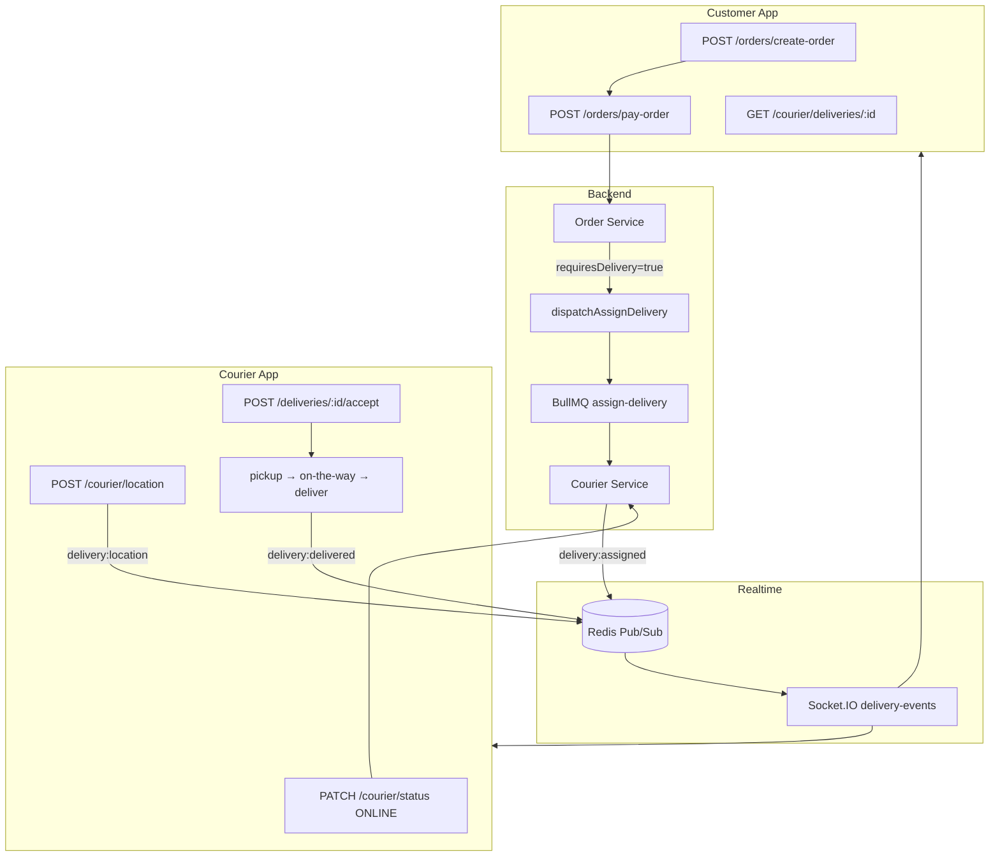
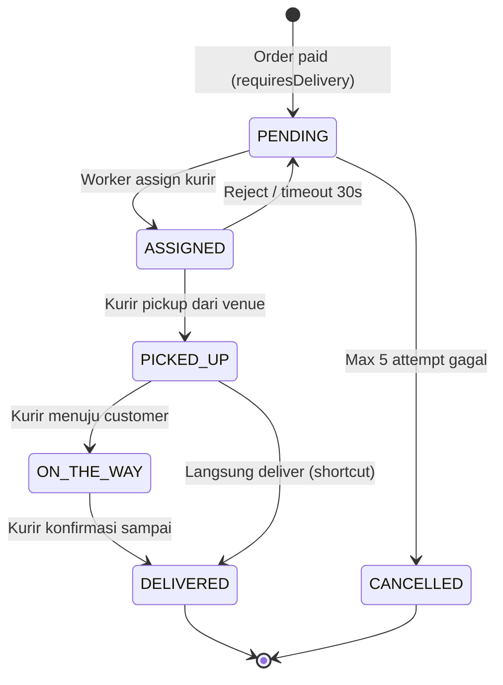
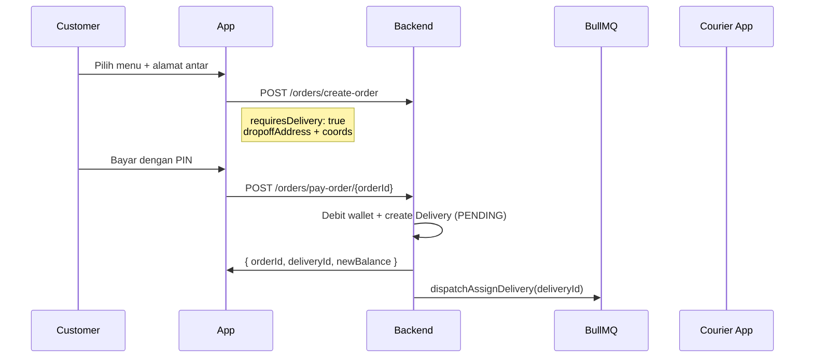

### Order Pay

```http
POST /api/v1/orders/pay-order/{orderId}
Authorization: Bearer <token>
Content-Type: application/json
{
  "pin": "123456"
}
```

**Response:**

```json
{
  "data": {
    "id": "payment-uuid",
    "orderId": "order-uuid",
    "deliveryId": "delivery-uuid",
    "newBalance": 150000
  }
}
```

> `deliveryId` hanya ada jika order dibuat dengan `requiresDelivery: true`.

---

## Integrasi FE — Payment

### Top-up Screen (React Native / Web)

```typescript
// 1. Create payment
const { data } = await api.post("/payment/topUp", {
  amount: 100000,
  bankCode: "bca",
});
const { paymentId, vaNumber, expiredAt } = data.data;
// 2. Open SSE (Web — native EventSource tidak support Authorization header)
//    Gunakan fetch + ReadableStream atau library seperti @microsoft/fetch-event-source
import { fetchEventSource } from "@microsoft/fetch-event-source";
await fetchEventSource(`${API_URL}/payment/${paymentId}/stream`, {
  headers: { Authorization: `Bearer ${token}` },
  onmessage(event) {
    if (event.event === "payment:completed") {
      const payload = JSON.parse(event.data);
      updateBalance(payload.newBalance);
      navigateToSuccess();
    }
    if (event.event === "payment:failed" || event.event === "payment:expired") {
      showError(event.event);
    }
  },
});
// 3. Polling fallback (jika SSE disconnect)
const poll = setInterval(async () => {
  const res = await api.get(`/payment/${paymentId}/status`);
  if (res.data.data.status !== "PENDING") {
    clearInterval(poll);
    handlePaymentResult(res.data.data);
  }
}, 5000);
```

### Global Socket.IO Listener

```typescript
import { io } from "socket.io-client";
const socket = io(SOCKET_URL, {
  auth: { token: accessToken },
  transports: ["websocket"],
});
// Update saldo di semua screen
socket.on("balance:updated", ({ payload }) => {
  if (payload.userId === currentUserId) {
    setBalance(payload.balance);
  }
});
// Notifikasi pembayaran sukses (semua jenis)
socket.on("payment:completed", ({ payload }) => {
  if (payload.entityType === "TOPUP") {
    showToast("Top-up berhasil!");
  }
  if (payload.entityType === "BOOKING") {
    refreshBookings();
  }
});
```

### Wallet Pay Screen

```typescript
// Primary: dari HTTP response
const res = await api.put(`/bookings/booking/payment/${bookingId}`, { pin });
updateBalance(res.data.data.newBalance);
navigateToBookingDetail(res.data.data.bookingId);
// Secondary: Socket.IO untuk sync cross-device (optional)
// Sudah di-handle global listener di atas
```

---

# Bagian 2: Courier & Delivery

## Arsitektur Courier



### Komponen

| Komponen            | File                                         | Fungsi                     |
| ------------------- | -------------------------------------------- | -------------------------- |
| Courier Service     | `src/modules/courier/courier.service.ts`     | Lifecycle kurir + delivery |
| Delivery Repository | `src/modules/courier/delivery.repository.ts` | CRUD + status transitions  |
| Assign Worker       | `src/queue/courier-worker.ts`                | Auto-assign kurir terdekat |
| Dispatch            | `src/queue/dispatch.ts`                      | Enqueue + timeout 30 detik |
| Geo Index           | `src/socket/courier.socket.ts`               | Redis GEO nearest courier  |
| Delivery Events     | `src/helpers/deliveryEvents.ts`              | Publish Socket.IO events   |

### Worker Auto-Start

## Courier worker (`assign-delivery` + `assignment-timeout`) otomatis start saat server jalan via import di `src/server.ts`.

## Status Lifecycle

### Delivery Status



| Status       | Arti                      | Trigger                            |
| ------------ | ------------------------- | ---------------------------------- |
| `PENDING`    | Menunggu kurir            | Delivery dibuat setelah order paid |
| `ASSIGNED`   | Kurir ditugaskan          | Worker assign / admin manual       |
| `PICKED_UP`  | Barang diambil dari venue | Kurir POST `/pickup`               |
| `ON_THE_WAY` | Menuju customer           | Kurir POST `/on-the-way`           |
| `DELIVERED`  | Selesai                   | Kurir POST `/deliver`              |
| `CANCELLED`  | Gagal assign 5x           | Auto cancel                        |

### Courier Status

| Status        | Arti                     |
| ------------- | ------------------------ |
| `OFFLINE`     | Tidak menerima order     |
| `ONLINE`      | Siap menerima assignment |
| `ON_DELIVERY` | Sedang mengantar         |
| `SUSPENDED`   | Dinonaktifkan admin      |

---

## Event Schema Delivery

### Socket.IO Events

| Event                 | Kapan                   | Penerima           |
| --------------------- | ----------------------- | ------------------ |
| `delivery:assigned`   | Kurir ditugaskan        | Customer + Courier |
| `delivery:accepted`   | Kurir konfirmasi terima | Customer + Courier |
| `delivery:picked_up`  | Barang diambil          | Customer + Courier |
| `delivery:on_the_way` | Menuju lokasi           | Customer + Courier |
| `delivery:delivered`  | Selesai                 | Customer + Courier |
| `delivery:cancelled`  | Gagal assign            | Customer           |
| `delivery:location`   | Update GPS kurir        | Customer           |

### Payload Standar

```typescript
interface DeliveryEventPayload {
  deliveryId: string;
  orderId?: string | null;
  bookingId?: string | null;
  userId?: string | null; // customer
  courierId?: string | null;
  courierUserId?: string | null; // user ID kurir (untuk Socket room)
  status:
    | "PENDING"
    | "ASSIGNED"
    | "PICKED_UP"
    | "ON_THE_WAY"
    | "DELIVERED"
    | "CANCELLED";
  pickupAddress?: string;
  dropoffAddress?: string;
  latitude?: number; // hanya untuk delivery:location
  longitude?: number;
}
```

## Event dikirim ke room `user:{userId}` **dan** `user:{courierUserId}`.

## Endpoint Courier

### Registrasi & Profil

| Method  | Path                | Role          | Deskripsi         |
| ------- | ------------------- | ------------- | ----------------- |
| `POST`  | `/courier/register` | Authenticated | Daftar jadi kurir |
| `GET`   | `/courier/profile`  | COURIER       | Profil kurir      |
| `PATCH` | `/courier/status`   | COURIER       | Online / Offline  |
| `POST`  | `/courier/location` | COURIER       | Update GPS        |

**Register:**

```json
{
  "vehicleType": "MOTORCYCLE",
  "plateNumber": "DR 1234 AB"
}
```

`vehicleType`: `MOTORCYCLE` | `CAR` | `BICYCLE` | `WALKING`
**Go Online:**

```json
{
  "status": "ONLINE"
}
```

**Update Location (kirim setiap 5–10 detik saat ONLINE/on delivery):**

```json
{
  "latitude": -8.5833,
  "longitude": 116.1167
}
```

### Delivery — Kurir

| Method | Path                                  | Deskripsi            |
| ------ | ------------------------------------- | -------------------- |
| `GET`  | `/courier/deliveries/active`          | Order aktif saat ini |
| `GET`  | `/courier/deliveries/history`         | Riwayat delivery     |
| `POST` | `/courier/deliveries/{id}/accept`     | Terima assignment    |
| `POST` | `/courier/deliveries/{id}/reject`     | Tolak assignment     |
| `POST` | `/courier/deliveries/{id}/pickup`     | Barang diambil       |
| `POST` | `/courier/deliveries/{id}/on-the-way` | Menuju customer      |
| `POST` | `/courier/deliveries/{id}/deliver`    | Selesai              |

### Delivery — Customer / Tracking

| Method | Path                                  | Deskripsi             |
| ------ | ------------------------------------- | --------------------- |
| `GET`  | `/courier/deliveries/{deliveryId}`    | Detail + lokasi kurir |
| `GET`  | `/courier/deliveries/order/{orderId}` | Tracking via order ID |

### Admin

| Method | Path                           | Deskripsi           |
| ------ | ------------------------------ | ------------------- |
| `POST` | `/courier/assign/{deliveryId}` | Manual assign kurir |

---

## Alur Order + Delivery


